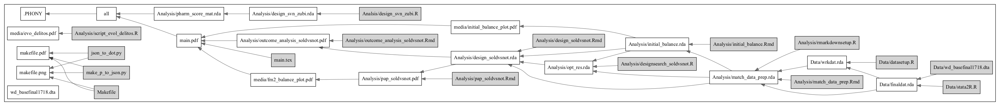

# A Paper on the Effects of Living near a Pharmacy that Sold Marijuana

## Key Design Features

 - Two surveys of 60 neighborhoods.

## General Workflow Rules

 - Most .R command files use data to produce tables or figures (plots) or output of some other kind. These files should begin by loading a data set and end by saving the table or plot (or other product like a new data file).

 - Other .R files are meant to be run within the first kind. These may define utility functions for use the project, for example, so they do not need to start with a data file and end with some kind of saving or printing.

 - In general we are running whole .R files at a time and saving the output as plain text files (using either the BATCH method to produce .Rout files or the source() method).

 - We place files that recode variables and merge datafiles in the `data/` subdirectory and other files in other subdirectories (so that any given directory is not overly cluttered).
 
 - The Makefile records the relationships between files. For example, to make a plot you might type `make analysis/scatterplot.pdf` and this should know whether or not to create the working data (`Data/wrkdat.rda`) first or not.

 - Avoid spaces in file names: different systems represent a space differently. It is just easier and not that much trouble to eliminate spaces in file names.

## Tracking dependencies among files

This version uses the GNU Makefile system. Here is a graph of the dependencies among the files in this project (created using the make2graph script installed via the homebrew system on os x using `brew install makefile2graph`):

```
make -Bnd | make2graph | dot -Tpng -o makefile.png
```



